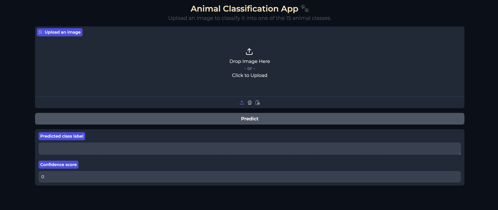
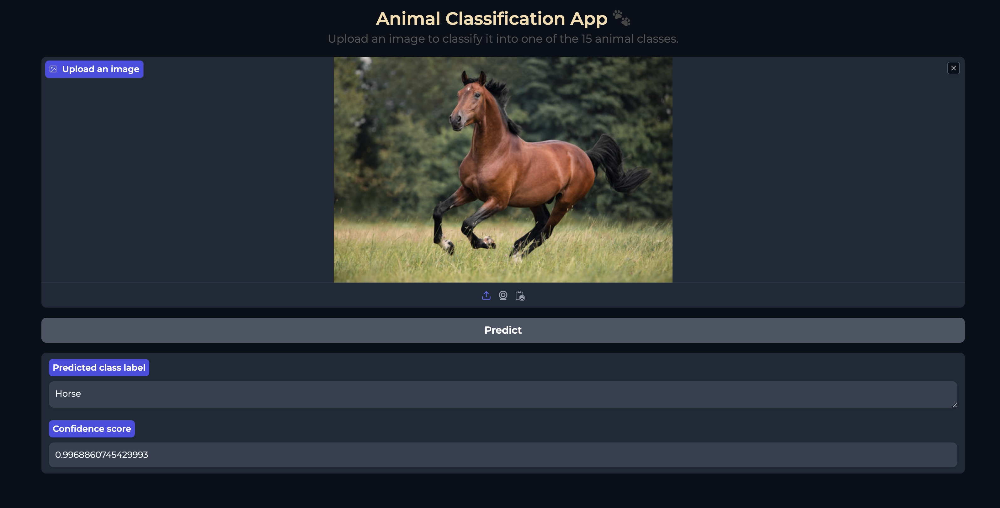
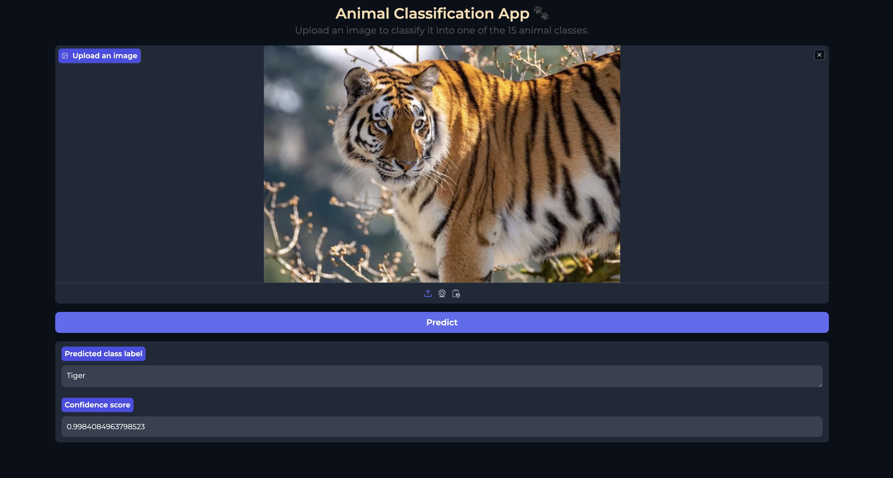
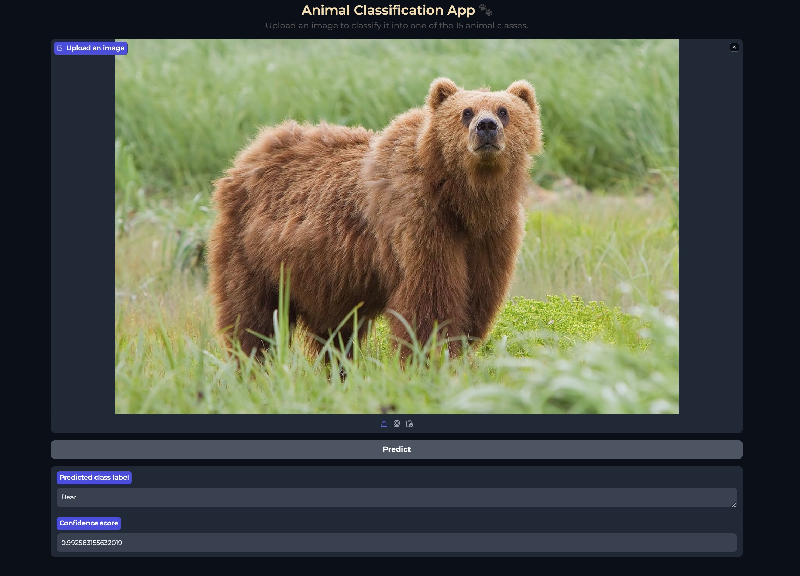

# Animal Image Classification

## Objective
The goal of this project was to develop an image classification system capable of identifying animals in given images. The model should have been able to classify 15 different species of animals.
## Dataset
The orginal dataset consists of 15 folders, each containing images of dimensions 224 x 224 x 3. The classes in the dataset are:
- Bear
- Bird
- Cat
- Cow
- Deer
- Dog
- Dolphin
- Elephant
- Giraffe
- Horse
- Kangaroo
- Lion
- Panda
- Tiger
- Zebra

## Approach
To achieve accurate classification, I explored various machine learning techniques, with a focus on Neural Networks and Transfer Learning. These methods  provided an optimal solution for the required image classification task.

## Repository Structure
- `app_screenshots/`: Contains the screenshots of the image classficiation system.
- `classify.py`: The source code for the image classification system, including a   Gradio-based graphical user interface (GUI).

- `Animal_Image_Model_Training.ipynb`: Jupyter notebook for model development and training.
- `README.md`: This file, providing an overview of the project.

## Screenshots

## Getting Started

### Training a New Model (Optional)
A trained model (based on the orginal dataset provided) via the notebook is already saved at https://file.io/HwQgcOuBZ12m .  To train a new model:

1. Run the Python notebook in `notebooks/`.
2. Feel free to customize hyperparameters, batch size, datasets, and augmentation to create your own model.

### Running the Image Classification System

To run the image classification system, follow these steps:

1. Clone the repository.
2. Install the required dependencies.
3. Run `classify.py`.
4. Upload test images and run the system via the Gradio interface.

